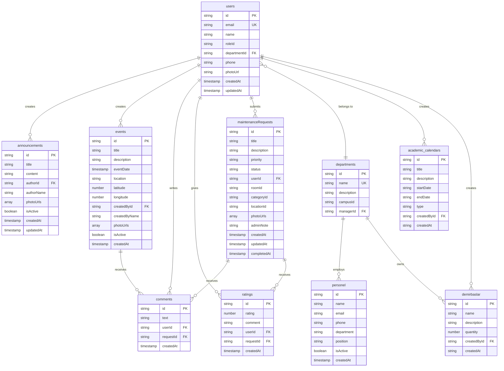

# Campus Care - Kampüs Yönetim Sistemi

Firebase Firestore tabanlı kampüs yönetim ve bakım takip sistemi.

## 📋 İçindekiler
- [Özellikler](#özellikler)
- [Veritabanı Yapısı](#veritabanı-yapısı)
- [Kurulum](#kurulum)

## 🚀 Özellikler

- ✅ Kullanıcı yönetimi (öğrenci, personel, admin)
- ✅ Bakım talep sistemi
- ✅ Etkinlik yönetimi
- ✅ Duyuru sistemi
- ✅ Demirbaş takibi
- ✅ Yorum ve değerlendirme sistemi

## 📊 Veritabanı Yapısı

### ER Diyagramı



### 📚 Collections (13 Tablo)

| Collection | Açıklama | İlişkiler |
|------------|----------|-----------|
| **users** | Kullanıcı bilgileri | departments (N:1) |
| **departments** | Bölüm bilgileri | - |
| **personel** | Personel kayıtları | users (N:1), departments (N:1) |
| **academic_calendars** | Akademik takvim | users (N:1) |
| **events** | Etkinlikler | users (N:1), comments (1:N) |
| **announcements** | Duyurular | users (N:1), comments (1:N) |
| **comments** | Yorumlar | users (N:1), maintenanceRequests (N:1) |
| **ratings** | Değerlendirmeler | users (N:1), maintenanceRequests (N:1) |
| **maintenanceRequests** | Bakım talepleri | users (N:1), rooms (N:1), categories (N:1) |
| **demirbaslar** | Demirbaş/Envanter | users (N:1), departments (N:1) |

### 🔑 Anahtar Özellikler

- **Primary Keys (PK)**: Her tabloda unique `id` alanı
- **Foreign Keys (FK)**: İlişkisel referanslar
- **Unique Keys (UK)**: Email, code gibi tekil alanlar
- **Timestamps**: Tüm işlemler zaman damgalı

## 🛠️ Kurulum

```bash
# Repository'yi klonlayın
git clone https://github.com/kullanici-adi/campus-care.git

# Bağımlılıkları yükleyin
npm install

# Firebase yapılandırması
# .env dosyasını oluşturun ve Firebase credentials'ı ekleyin

# Uygulamayı başlatın
npm start
```

## 📱 Teknolojiler

- Firebase Firestore (NoSQL Database)
- React Native / Flutter (Mobile)
- Node.js (Backend - opsiyonel)

